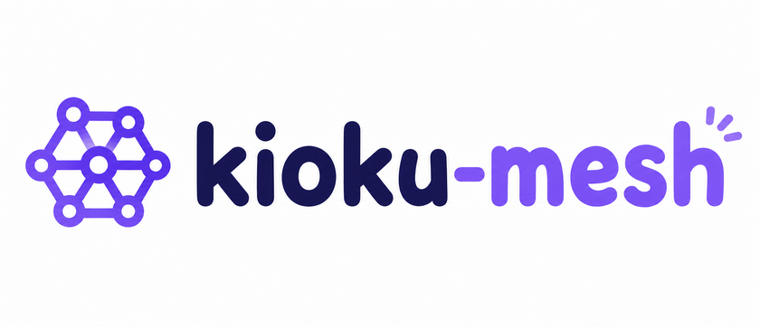
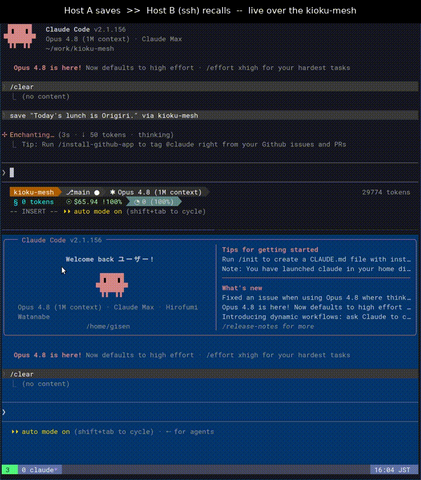
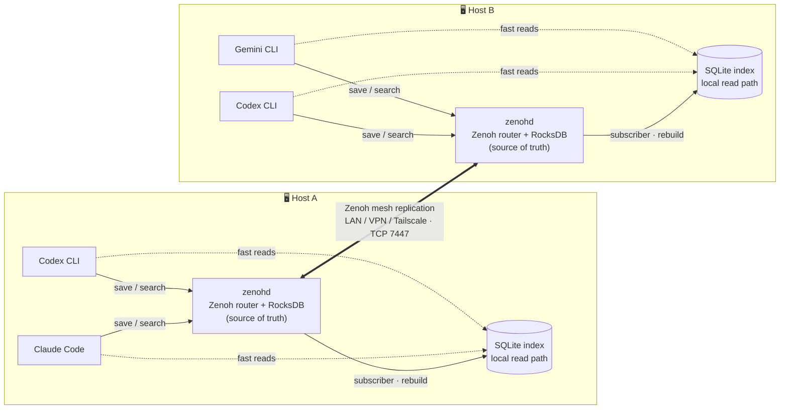
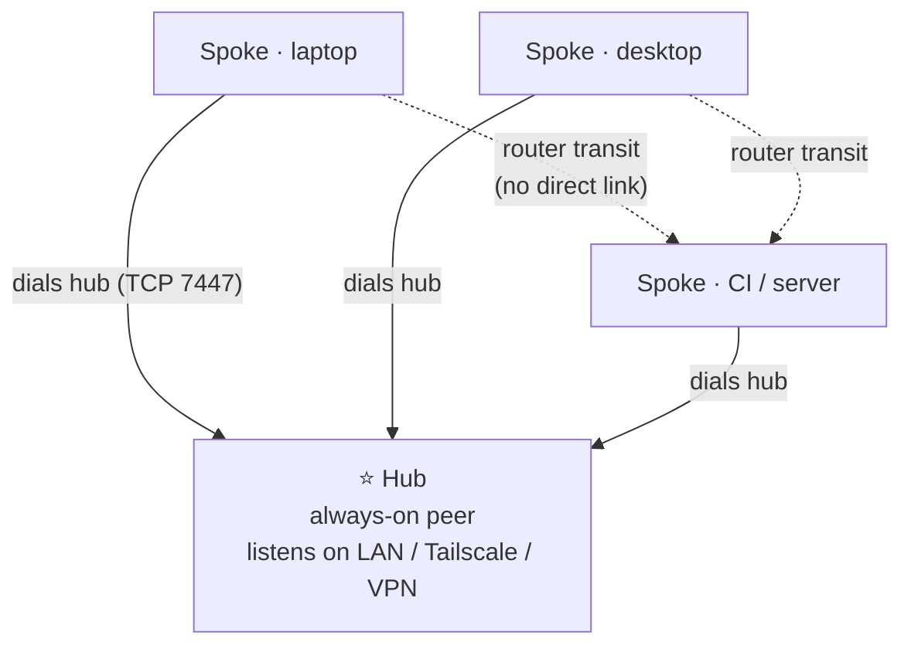

<p align="center">
  
</p>

<p align="center">
  <a href="https://pypi.org/project/kioku-mesh/"></a>
  <a href="https://pypi.org/project/kioku-mesh/"></a>
  <a href="LICENSE"></a>
</p>

<p align="center">
  <strong>Shared memory for AI coding agents, across tools and machines.</strong>
</p>

<p align="center">
  
</p>

`kioku` (記憶) means memory.

kioku-mesh gives coding agents a shared memory store. Claude Code, Codex CLI,
Gemini CLI, and other MCP clients can save and search the same observations from
one machine or from several machines on a trusted LAN/VPN mesh.

The default setup is local and needs no daemon. Mesh mode is available when you
want the same memory pool replicated between hosts.

## Why kioku-mesh

Coding-agent context gets fragmented across machines: which laptop did that work,
what did the agent on the other host decide, and why does a secondary agent have
to re-read everything from scratch just to give a quick second opinion?
kioku-mesh keeps that memory in one shared pool so any agent, on any of your
machines, can recall it.

Unlike long-term memory tools that store everything in one place, the shared
pool is a peer-to-peer mesh you run yourself across your own machines
(LAN / VPN / Tailscale) — no SaaS, no central account. The same memory is
readable by Claude Code, Codex CLI, Gemini CLI, and any other MCP client.

## Quickstart

```bash
uv tool install kioku-mesh
# or: pip install kioku-mesh

kioku-mesh init --mode local
kioku-mesh save "Chose Postgres over SQLite for analytics"
kioku-mesh search "Postgres"
```

Install the MCP server for your agent:

```bash
kioku-mesh mcp install --client claude-code
kioku-mesh mcp install --client codex-cli
```

The package installs two commands:

- `kioku-mesh`: the CLI.
- `kioku-mesh-mcp`: the stdio MCP server launched by your agent.

## Modes

| Mode | Use it when | Persistence | Extra service |
|---|---|---|---|
| `local` | You want memory on one machine | SQLite | none |
| `hub` | This machine is the always-on mesh hub | RocksDB | `zenohd` |
| `spoke` | This machine connects to a hub | RocksDB | `zenohd` |

`local` is the default and the easiest starting point. Re-run
`kioku-mesh init --mode <mode> --force` when you want to switch. For a
short-lived Zenoh smoke test without provisioning anything, use
`kioku-mesh mesh start`.

In mesh mode the Zenoh/RocksDB store is the source of truth, and each host's
SQLite is a fast local read cache rebuilt from it — not a separate copy you have
to reconcile. `local` mode is a standalone, SQLite-only setup for a single
machine, so its saves live only in that local store and are not replicated to a
mesh.

## CLI

```bash
kioku-mesh save "Decided to keep billing events append-only" \
  --memory-type decision \
  --importance 4 \
  --subject billing

kioku-mesh search "billing events"
kioku-mesh get-memory <observation_id>
kioku-mesh delete <observation_id>
kioku-mesh gc --retention-days 30
kioku-mesh doctor
```

Useful environment variables:

> **Note (ADR-0024):** The env var prefix was renamed from `MESH_MEM_` to `KIOKU_MESH_`.
> The old `MESH_MEM_*` names are still accepted as a deprecated fallback until v1.0.0.

| Variable | Purpose |
|---|---|
| `KIOKU_MESH_AGENT_FAMILY` | Agent family, such as `claude` or `codex` |
| `KIOKU_MESH_CLIENT_ID` | Client name, such as `claude-code` |
| `KIOKU_MESH_SESSION_ID` | Optional stable session id |
| `KIOKU_MESH_STATE_DIR` | State directory; defaults under the user data dir |
| `KIOKU_MESH_BACKEND` | Override the backend selected by `~/.config/kioku-mesh/config.yaml`; set `local` or `zenoh` |
| `KIOKU_MESH_FORCE_REBUILD=1` | Rebuild the local index at CLI startup |
| `KIOKU_MESH_DISABLE_INDEX=1` | Use the legacy Zenoh scan path instead of SQLite index |
| `KIOKU_MESH_USER_ID` | Your user slug for `--visibility user` (same value on all your machines) |
| `KIOKU_MESH_TEAM_ID` | Team slug for `--visibility team` |
| `KIOKU_MESH_DEFAULT_VISIBILITY` | Default scope for new saves: `user`, `team`, `mesh` (unset = legacy layout) |

### Visibility scopes (experimental)

`save` and the MCP `save_observation` tool accept `--visibility` /
`visibility` to choose how far a memory replicates:

- `user` — only this user's machines (requires `user_id`, set via
  `KIOKU_MESH_USER_ID` or `user_id:` in `~/.config/kioku-mesh/config.yaml`;
  use the same value on every machine you own)
- `team` — peers that host the team's storage (requires `team_id`)
- `mesh` — every peer on the mesh
- unset — follows `default_visibility` from config; with no config the
  legacy layout is used and nothing changes

The user/team ids are resolved from server-side configuration, never from
tool arguments. See ADR-0019 for the design.

A per-project default can be set with a `.kioku-mesh.yaml` in the repository
(found by searching upward from the current directory; env vars still win,
the global config is the fallback):

```yaml
# .kioku-mesh.yaml — project-local defaults
default_visibility: team
team_id: kioku-mesh
```

`user_id` is intentionally **not** read from this file (a committed file must
never set a personal namespace), and every save response echoes the effective
scope, e.g. `saved: <id> (visibility=team/kioku-mesh)`.

## MCP Clients

`kioku-mesh mcp install` handles the common setups:

```bash
kioku-mesh mcp install --client claude-code
kioku-mesh mcp install --client codex-cli
```

For Claude Desktop, Gemini CLI, ChatGPT Desktop, manual JSON/TOML examples,
SessionStart hooks, and multi-agent identity recipes, see
[docs/mcp-clients.md](docs/mcp-clients.md) and
[docs/multi-agent.md](docs/multi-agent.md).

## Multi-Host Mesh

Each host serves its agents from a fast local SQLite read index, backed by a
Zenoh router + RocksDB store, and hosts replicate to each other over the mesh:



The recommended topology is one hub and any number of spokes. The hub listens on
addresses reachable from the spokes; every spoke dials only the hub.



```bash
# 1. Install zenohd + zenoh-backend-rocksdb (default: ~/.local/share/kioku-mesh/bin/)
kioku-mesh zenohd install

# 2. Add to PATH (the command prints the exact export line after install)
export PATH="$HOME/.local/share/kioku-mesh/bin:$PATH"
# Persist: add the line above to ~/.bashrc or ~/.zshrc

# 3. Generate config and, optionally, a systemd user unit for login auto-start
# hub
kioku-mesh init --mode hub \
  --listen 127.0.0.1 \
  --listen 192.168.3.10 \
  [--install-systemd]

# spoke
kioku-mesh init --mode spoke \
  --listen 127.0.0.1 \
  --connect 192.168.3.10 \
  [--install-systemd]

# Without --install-systemd, start zenohd manually:
zenohd -c ~/.config/kioku-mesh/zenohd.json5
```

`kioku-mesh zenohd install` auto-detects your arch and OS, fetches the matching
standalone zip from GitHub Releases, verifies the SHA-256 checksum via the GitHub
Releases API, and extracts `zenohd` and the RocksDB plugin into the target directory.
Options: `--version 1.9.0` (default), `--bin-dir DIR`, `--verbose`.

For a smoke test without installing anything, `kioku-mesh mesh start` runs an
in-process Zenoh router (no `zenohd` binary required).

Advanced / offline: if you prefer to obtain the binaries yourself, place `zenohd`
and the RocksDB plugin on `PATH` manually and then run `kioku-mesh init` as above.

kioku-mesh is designed to run inside a closed, trusted network. Keep port
`7447/tcp` reachable only between trusted peers. Do not expose it to the
internet or an untrusted LAN. By default kioku-mesh relies on network
admission (Tailscale, WireGuard, firewall rules, or a trusted LAN) rather than
transport-level authentication.

When network admission alone is not enough, enable **mutual TLS**: every peer
presents a certificate signed by your own private CA, and zenohd refuses any
unverified link. Each peer's private key is generated locally and never leaves
the host — only CSRs and signed certs (all non-secret) are exchanged.

```bash
kioku-mesh tls init-ca                            # once, on the CA host
kioku-mesh tls enroll <ca-host> --san <this-ip>   # on each peer (needs SSH to the CA host)
kioku-mesh init --mode <hub|spoke> --tls --listen ... --force
```

No SSH? The copy-paste flow works over any channel: `tls request` prints a CSR
block, paste it into `tls sign` on the CA host, paste the bundle it returns into
`tls install`. The peer key never leaves the host; only non-secret blocks move.

See [docs/mtls.md](docs/mtls.md) for the full walkthrough, the trust model, and
certificate rotation.

For a full walkthrough with firewall notes, five-peer examples, add/remove
procedures, and smoke tests, see
[config/peers/example_5peer.md](config/peers/example_5peer.md).

## Development

```bash
pip install -e '.[dev,test]'
pytest tests/ -q
```

Run focused MCP checks with:

```bash
pytest tests/test_mcp_server.py tests/test_mcp_cli.py -v
```

## Notes

- Python 3.10+ is required.
- Linux is the primary development and deployment target.
- Windows users should prefer WSL2. Native setup notes are in
  [docs/windows-setup.md](docs/windows-setup.md).
- macOS support is not verified yet.
- `delete` writes a tombstone. `gc` performs physical cleanup.
- `0.x` releases are experimental; breaking changes can happen in minor
  versions.

More detail lives in [docs/Spec.md](docs/Spec.md), [CHANGELOG.md](CHANGELOG.md),
and the design records under [docs/adr/](docs/adr/).

## Acknowledgments

kioku-mesh was influenced by
[engram](https://github.com/Gentleman-Programming/engram) and
[claude-mem](https://github.com/thedotmack/claude-mem). No code is copied from
either project.
