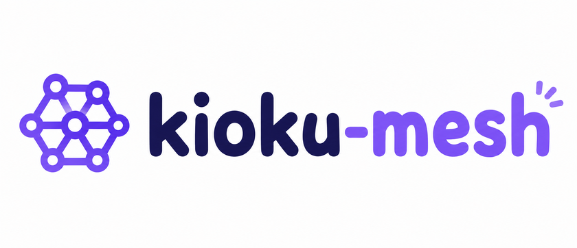
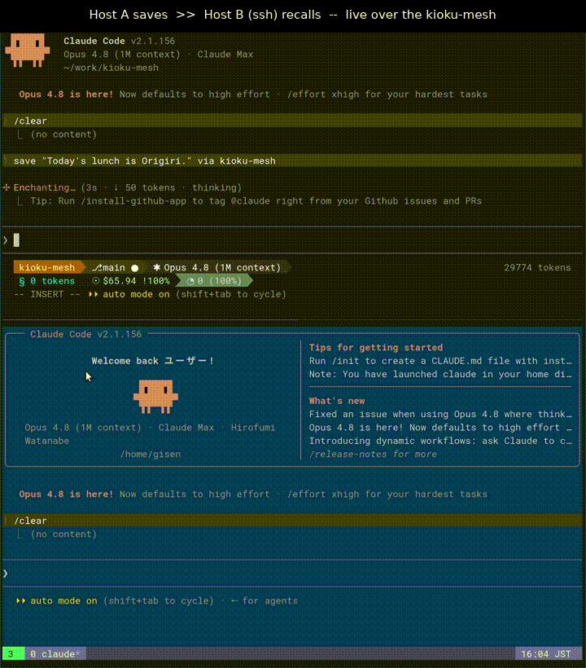
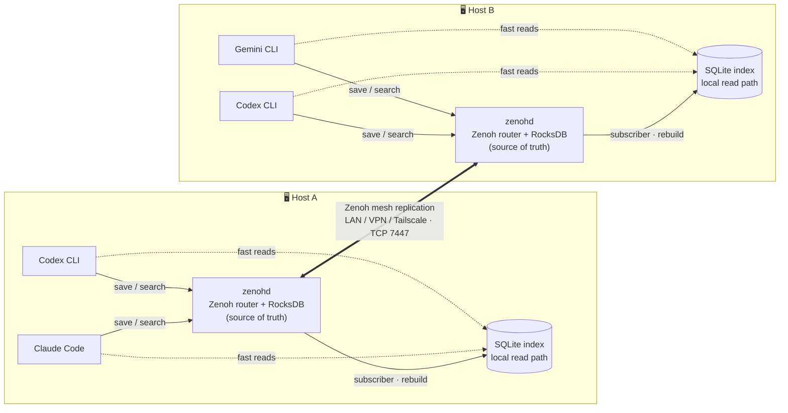
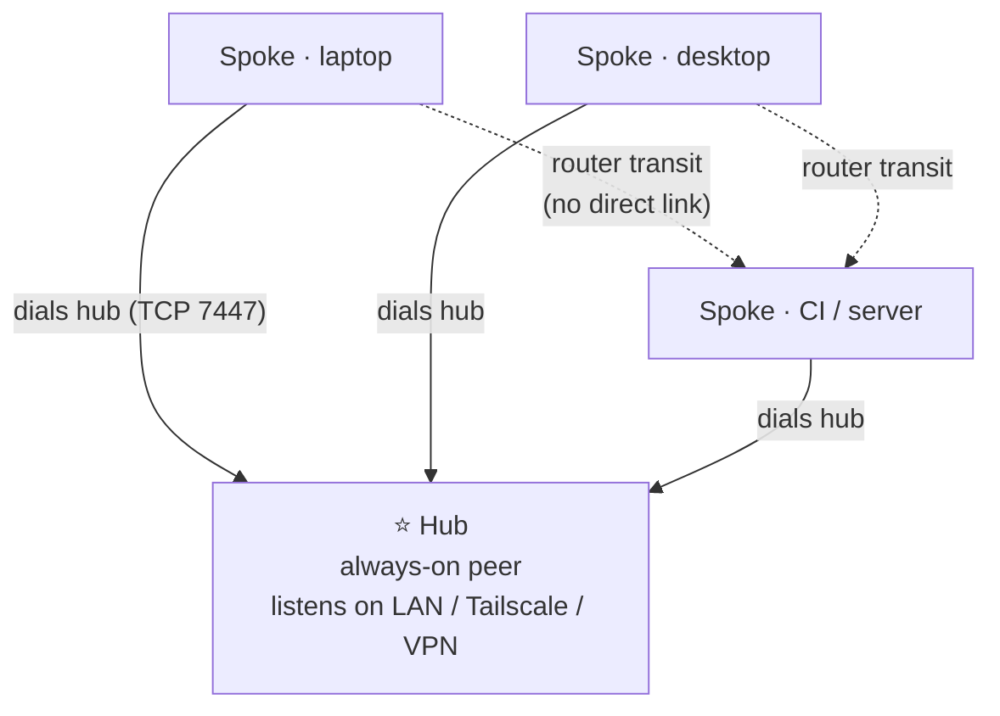

<p align="center">
  
</p>

<p align="center">
  <a href="https://pypi.org/project/kioku-mesh/"></a>
  <a href="https://pypi.org/project/kioku-mesh/"></a>
  <a href="LICENSE"></a>
</p>

<p align="center">
  <strong>A shared memory mesh for AI coding agents — across every tool and machine you own.</strong>
</p>

<p align="center">
  
</p>

`kioku` (記憶) means memory.

kioku-mesh gives coding agents a shared memory mesh. Claude Code, Codex CLI,
Gemini CLI, and other MCP clients can save and search the same observations from
one machine or from several machines on a trusted LAN/VPN mesh.

The default setup is local and needs no daemon. Mesh mode is available when you
want the same memory pool replicated between hosts.

## Why kioku-mesh

Coding-agent context gets fragmented across machines: which laptop did that work,
what did the agent on the other host decide, and why does a secondary agent have
to re-read everything from scratch just to give a quick second opinion?
kioku-mesh keeps that memory in one shared pool so any agent, on any of your
machines, can recall it.

Unlike long-term memory tools that store everything in one place, the shared
pool is a peer-to-peer mesh you run yourself across your own machines
(LAN / VPN / Tailscale) — no SaaS, no central account. The same memory is
readable by Claude Code, Codex CLI, Gemini CLI, and any other MCP client.

## Quickstart

```bash
uv tool install kioku-mesh
# or: pip install kioku-mesh

kioku-mesh init --mode local
kioku-mesh save "Chose Postgres over SQLite for analytics"
kioku-mesh search "Postgres"
```

Install the MCP server for your agent:

```bash
kioku-mesh mcp install --client claude-code
kioku-mesh mcp install --client codex-cli
```

The package installs two commands:

- `kioku-mesh`: the CLI.
- `kioku-mesh-mcp`: the stdio MCP server launched by your agent.

## Modes

| Mode | Use it when | Persistence | Extra service |
|---|---|---|---|
| `local` | You want memory on one machine | SQLite | none |
| `hub` | This machine is the always-on mesh hub | RocksDB | `zenohd` |
| `spoke` | This machine connects to a hub | RocksDB | `zenohd` |

`local` is the default and the easiest starting point. Re-run
`kioku-mesh init --mode <mode> --force` when you want to switch. For a
short-lived Zenoh smoke test without provisioning anything, use
`kioku-mesh mesh start`.

In mesh mode the Zenoh/RocksDB store is the source of truth, and each host's
SQLite is a fast local read cache rebuilt from it — not a separate copy you have
to reconcile. `local` mode is a standalone, SQLite-only setup for a single
machine, so its saves live only in that local store and are not replicated to a
mesh.

## CLI

```bash
# --subject and --summary are required
kioku-mesh save "Decided to keep billing events append-only" \
  --memory-type decision \
  --importance 4 \
  --subject billing \
  --summary "billing events stay append-only"

kioku-mesh search "billing events"
kioku-mesh get-memory <observation_id>
kioku-mesh delete <observation_id>
kioku-mesh gc --retention-days 30
kioku-mesh doctor
```

Useful environment variables (the `MESH_MEM_` prefix was renamed to
`KIOKU_MESH_` in ADR-0024; only `KIOKU_MESH_*` is read as of `v1.0.0`):

| Variable | Purpose |
|---|---|
| `KIOKU_MESH_AGENT_FAMILY` | Agent family, such as `claude` or `codex`. Falls back to launcher detection (`CLAUDECODE` and friends; skipped when markers of several agents are present at once, as with nested launches), then to `unknown` with a warning |
| `KIOKU_MESH_CLIENT_ID` | Client name, such as `claude-code` |
| `KIOKU_MESH_SESSION_ID` | Optional stable session id |
| `KIOKU_MESH_STATE_DIR` | State directory; defaults under the user data dir |
| `KIOKU_MESH_BACKEND` | Override the backend selected by `~/.config/kioku-mesh/config.yaml`; set `local` or `zenoh` |
| `KIOKU_MESH_USER_ID` | Your user slug for `--visibility user` (same value on all your machines) |
| `KIOKU_MESH_TEAM_ID` | Team slug for `--visibility team` |
| `KIOKU_MESH_DEFAULT_VISIBILITY` | Default scope for new saves: `user`, `team`, `mesh` (unset = `mesh` since Phase D / v0.8) |

Troubleshooting variables (`KIOKU_MESH_FORCE_REBUILD`, `KIOKU_MESH_DISABLE_INDEX`,
`KIOKU_MESH_SKIP_REBUILD`, `KIOKU_MESH_INDEX_DB`) are documented in
[docs/Spec.md](docs/Spec.md#13-環境変数).

### Visibility migration

If you have observations written before v0.8 (legacy layout `mem/obs/**`):

```bash
kioku-mesh doctor --check-legacy-namespace              # 1. check what remains
kioku-mesh migrate-visibility --from legacy --to mesh   # 2. migrate
kioku-mesh doctor                                       # 3. confirm zero legacy obs/tomb
```

As of `v1.0.0` (ADR-0029), `KIOKU_MESH_LEGACY_WRITE_EMERGENCY` and
`KIOKU_MESH_LEGACY_READ_FALLBACK` are removed and have no effect.

### Visibility scopes

`--visibility` (CLI) / `visibility` (MCP `save_observation`) controls how far
a memory replicates: `user` (your machines only, needs `user_id`), `team`
(peers hosting that team's storage, needs `team_id`), or `mesh` (every peer,
the default). Ids are resolved server-side, never from tool args — see ADR-0019.

A per-project default can be set via `.kioku-mesh.yaml` (searched upward from
the cwd; env vars win, the global config is the fallback). Only
`default_visibility` / `team_id` may be set this way, never `user_id` — a
committed file must not set a personal namespace. Every save response echoes
the effective scope, e.g. `saved: <id> (visibility=team/kioku-mesh)`.

## MCP Clients

`kioku-mesh mcp install` handles the common setups:

```bash
kioku-mesh mcp install --client claude-code
kioku-mesh mcp install --client codex-cli
```

For Claude Desktop, Gemini CLI, ChatGPT Desktop, manual JSON/TOML examples,
SessionStart hooks, and multi-agent identity recipes, see
[docs/mcp-clients.md](docs/mcp-clients.md) and [docs/multi-agent.md](docs/multi-agent.md).

## Multi-Host Mesh

Each host serves agents from a local SQLite read index backed by a Zenoh
router + RocksDB store, and hosts replicate to each other over the mesh:


```mermaid
flowchart LR
  subgraph HostA["🖥️ Host A"]
    direction TB
    A1["Claude Code"]
    A2["Codex CLI"]
    AS[("SQLite index<br/>local read path")]
    AZ["zenohd<br/>Zenoh router + RocksDB<br/>(source of truth)"]
    A1 & A2 -->|"save / search"| AZ
    AZ -->|"subscriber · rebuild"| AS
    A1 & A2 -.->|"fast reads"| AS
  end
  subgraph HostB["🖥️ Host B"]
    direction TB
    B1["Codex CLI"]
    B2["Gemini CLI"]
    BS[("SQLite index<br/>local read path")]
    BZ["zenohd<br/>Zenoh router + RocksDB<br/>(source of truth)"]
    B1 & B2 -->|"save / search"| BZ
    BZ -->|"subscriber · rebuild"| BS
    B1 & B2 -.->|"fast reads"| BS
  end
  AZ <==>|"Zenoh mesh replication<br/>LAN / VPN / Tailscale · TCP 7447"| BZ
```

The recommended topology is one hub and any number of spokes: every spoke dials only the hub.


```mermaid
flowchart TB
  HUB["⭐ Hub<br/>always-on peer<br/>listens on LAN / Tailscale / VPN"]
  S1["Spoke · laptop"]
  S2["Spoke · desktop"]
  S3["Spoke · CI / server"]
  S1 -->|"dials hub (TCP 7447)"| HUB
  S2 -->|"dials hub"| HUB
  S3 -->|"dials hub"| HUB
  S1 -.->|"router transit<br/>(no direct link)"| S3
  S2 -.->|"router transit"| S3
```

```bash
# 1. Install zenohd + zenoh-backend-rocksdb (default: ~/.local/share/kioku-mesh/bin/)
kioku-mesh zenohd install
export PATH="$HOME/.local/share/kioku-mesh/bin:$PATH"  # persist in ~/.bashrc or ~/.zshrc

# 2. Generate config (add --install-systemd for a login-time auto-start unit)
kioku-mesh init --mode hub --listen 127.0.0.1 --listen 192.168.3.10     # hub
kioku-mesh init --mode spoke --listen 127.0.0.1 --connect 192.168.3.10 # spoke

# 3. Without --install-systemd, start zenohd manually:
zenohd -c ~/.config/kioku-mesh/zenohd.json5
```

### Docker (zenohd)

If Docker is available, `docker compose up -d` starts zenohd + RocksDB
without an apt install or touching `src/kioku_mesh/`. Data persists under
`./data/zenoh/`; the default `docker-compose.yaml` publishes ports on all
interfaces (`0.0.0.0`) — restrict to `127.0.0.1` or a trusted network.
Backups, connecting other peers, and upgrading Zenoh are covered in
[docs/zenohd-docker.ja.md](docs/zenohd-docker.ja.md).

Prefer not to use Docker? `kioku-mesh zenohd install` auto-detects your
arch/OS and installs a checksum-verified `zenohd` + RocksDB plugin (or place
the binaries on `PATH` yourself for an offline install). `kioku-mesh mesh
start` runs an in-process Zenoh router for a smoke test — no binary required.

kioku-mesh is designed to run inside a closed, trusted network — keep port
`7447/tcp` reachable only between trusted peers, never an untrusted LAN or
the internet. By default it relies on network admission (Tailscale,
WireGuard, firewall rules) rather than transport-level auth.

When network admission alone is not enough, enable **mutual TLS**: every peer
presents a certificate signed by your own private CA, and zenohd refuses any
unverified link. Each peer's private key is generated locally and never leaves
the host — only CSRs and signed certs (all non-secret) are exchanged.

```bash
kioku-mesh tls init-ca                            # once, on the CA host
kioku-mesh tls enroll <ca-host> --san <this-ip>   # on each peer (needs SSH to the CA host)
kioku-mesh init --mode <hub|spoke> --tls --listen ... --force
```

No SSH? The copy-paste flow works over any channel: `tls request` prints a CSR
block, paste it into `tls sign` on the CA host, paste the bundle it returns into
`tls install`. The peer key never leaves the host; only non-secret blocks move.

See [docs/mtls.md](docs/mtls.md) for the full walkthrough, the trust model, and
certificate rotation.

For a full walkthrough with firewall notes, five-peer examples, add/remove
procedures, and smoke tests, see
[config/peers/example_5peer.md](config/peers/example_5peer.md).

## Development

```bash
pip install -e '.[dev,test]'
pytest tests/ -q
pytest tests/test_mcp_server.py tests/test_mcp_cli.py -v  # focused MCP checks
```

## Notes

- Python 3.10+ is required.
- Linux is the primary development and deployment target.
- Windows users should prefer WSL2. Native setup notes are in
  [docs/windows-setup.md](docs/windows-setup.md).
- macOS support is not verified yet.
- `delete` writes a tombstone. `gc` performs physical cleanup.
- `0.x` releases are experimental; breaking changes can happen in minor
  versions. From `1.0.0` onward, the public CLI / MCP / Python API and
  on-disk schema follow Semantic Versioning: breaking changes require a
  semver-major bump or an explicit migration path (ADR-0029).

More detail lives in [docs/Spec.md](docs/Spec.md), [CHANGELOG.md](CHANGELOG.md),
and the design records under [docs/adr/](docs/adr/).

## Acknowledgments

kioku-mesh was influenced by
[engram](https://github.com/Gentleman-Programming/engram) and
[claude-mem](https://github.com/thedotmack/claude-mem). No code is copied from
either project.
