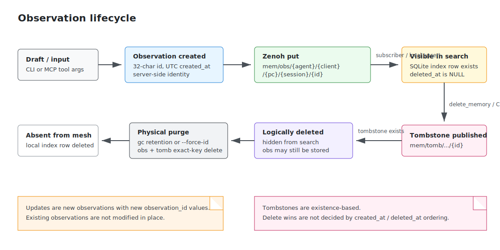
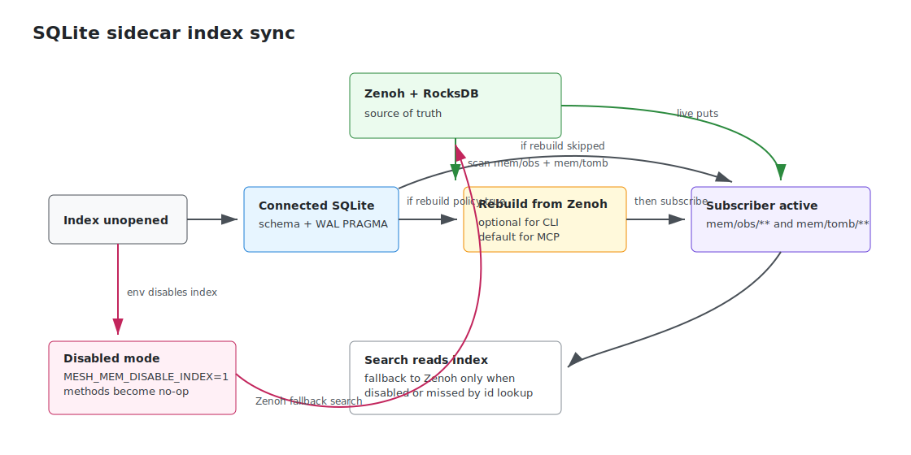

# mesh-mem 現状仕様

この文書は、2026-05-10 時点のリポジトリ実装から読み取れる現状仕様をまとめたものです。将来構想ではなく、`src/mesh_mem/` と `tests/` が現在保証している振る舞いを基準にしています。

関連図:

- draw.io 編集元: [mesh-mem-state-transitions.drawio](./mesh-mem-state-transitions.drawio)

### Observation lifecycle



### SQLite sidecar index sync



## 1. 目的と前提

mesh-mem は、複数の AI コーディングエージェントと複数 PC が作業上の観測・判断・不具合原因・設定変更などを共有するための分散メモリです。

- トランスポートは Zenoh 1.9 系を前提とする。
- 永続化の真実は zenohd + RocksDB backend 上の key-value にある。
- Python 側の SQLite は検索高速化のためのローカルサイドカーであり、正本ではない。
- MCP サーバは stdio transport を前提とし、Claude Code / Claude Desktop / Gemini CLI / Codex CLI などの MCP ホストから呼び出される。
- パッケージの公開名は `mesh-mem`、CLI は `mesh-mem`、MCP サーバは `mesh-mem-mcp`。

## 2. データモデル

### Observation

Observation は保存されるメモリ本体で、原則 immutable です。内容を更新する場合は既存 ID を変更せず、新しい Observation を保存します。

主なフィールド:

| フィールド | 型 | 既定値 / 仕様 |
| --- | --- | --- |
| `content` | `str` | 本文。必須。 |
| `agent_family` | `str` | `MESH_MEM_AGENT_FAMILY`。未設定時は `unknown`。 |
| `client_id` | `str` | `MESH_MEM_CLIENT_ID`。未設定時は `unknown`。 |
| `pc_id` | `str` | ホスト単位の永続 UUID。 |
| `session_id` | `str` | プロセス単位 ID。 |
| `project` | `str` | 任意のプロジェクト名。 |
| `tags` | `list[str]` | 任意タグ。 |
| `observation_id` | `str` | 32 文字 hex の UUID4。 |
| `created_at` | `str` | UTC の `YYYY-MM-DDTHH:MM:SS.ffffffZ`。 |
| `memory_type` | `str` | `note` / `decision` / `bug` / `pattern` / `config` / `summary`。 |
| `importance` | `int` | 1-5。モデル生成時は範囲外を clamp、CLI は argparse で 1-5 のみ許可。既定値 2。 |
| `subject` | `str` | 短いトピック名。 |
| `summary` | `str` | 検索結果で本文より優先表示される 1 行要約。 |
| `source_files` | `list[str]` | 関連ファイルパス。 |
| `supersedes` | `list[str]` | 置き換え元 Observation ID。 |

JSON 読み込みは forward/backward compatible です。未知フィールドは無視され、古い JSON に存在しない追加フィールドは既定値で補完されます。未知の `memory_type` を受信した場合は例外にせず `note` に丸め、WARNING ログを出します。

### Tombstone

削除は Observation 自体を即時削除せず、対応する tombstone を発行して表現します。

主なフィールド:

| フィールド | 型 | 仕様 |
| --- | --- | --- |
| `observation_id` | `str` | 削除対象の 32 文字 ID。 |
| `reason` | `str` | 任意の削除理由。 |
| `deleted_at` | `str` | UTC の `YYYY-MM-DDTHH:MM:SS.ffffffZ`。 |

Tombstone の存在そのものが削除シグナルです。timestamp の大小ではなく、対応する tombstone が 1 件でも観測されると検索結果から隠します。

## 3. Zenoh key 設計

Observation の key:

```text
mem/obs/{agent_family}/{client_id}/{pc_id}/{session_id}/{observation_id}
```

Tombstone の key:

```text
mem/tomb/{agent_family}/{client_id}/{pc_id}/{session_id}/{observation_id}
```

Tombstone key は Observation key の `mem/obs/` を `mem/tomb/` に置き換えたミラー構造です。

検索時の identity フィルタは key 階層に対応します。`agent_family` / `client_id` / `pc_id` / `session_id` を指定すると、その階層を絞り込みます。

## 4. Identity

Identity は保存時にサーバ側で解決されます。MCP の `save_observation` は identity を引数に持ちません。これは LLM が誤った identity を渡して名前空間を汚染するのを避けるためです。

解決規則:

| 識別子 | 解決方法 |
| --- | --- |
| `agent_family` | `MESH_MEM_AGENT_FAMILY`。未設定時 `unknown`。 |
| `client_id` | `MESH_MEM_CLIENT_ID`。未設定時 `unknown`。 |
| `pc_id` | `MESH_MEM_STATE_DIR/pc_id` に永続化。なければ UUID4 を生成。 |
| `session_id` | `MESH_MEM_SESSION_ID`。未設定時は `{YYYYMMDDTHHMMSSZ}-{uuid8}` を生成し、プロセス内でキャッシュ。 |

`pc_id` の初回生成は一時ファイルと hard link publish により、複数プロセスの同時起動でも空ファイルや不一致 ID を避けます。`MESH_MEM_STATE_DIR` は POSIX hard link をサポートするファイルシステム上に置く必要があります。

状態ディレクトリ:

- `MESH_MEM_STATE_DIR` が非空ならそれを使用。
- Linux は `~/.local/share/mesh-mem` 固定。`XDG_DATA_HOME` は互換性維持のため無視。
- macOS は `~/Library/Application Support/mesh-mem` 相当を `platformdirs` で解決。
- Windows は `%LOCALAPPDATA%\mesh-mem` 相当を `platformdirs` で解決。

## 5. 保存・検索・取得

### 保存

CLI の `mesh-mem save` と MCP の `save_observation` は、どちらも `Observation` を作成し Zenoh に `put` します。Zenoh への書き込み成功が保存成功の契約です。

保存後、SQLite ローカルインデックスにも best-effort で upsert します。SQLite エラーはログに記録されますが、Zenoh 書き込み成功を取り消しません。

### 検索

既定の検索経路は SQLite ローカルインデックスです。

- `project` / `agent_family` / `client_id` / `pc_id` / `session_id` / `since_iso` / `query` / `limit` を組み合わせて絞り込む。
- フィルタは AND 条件。
- tombstone 済みの行は既定で除外。
- 結果は `created_at DESC`。
- `limit` は 1 以上、最大 `MAX_SEARCH=10000` に丸める。これは返却件数上限であり、Zenoh fallback 時の走査件数上限ではない。
- SQLite 経路の `query` は `payload_json` 全体への case-insensitive substring match。本文だけでなく project、tags、subject、summary などにも一致しうる。

`MESH_MEM_DISABLE_INDEX=1` の場合、検索は Zenoh fallback 経路になります。この経路では `mem/obs/...` と `mem/tomb/...` を取得し、Python 側で project / since / query をフィルタします。Zenoh selector で絞れるのは identity 階層のみです。

### 単一取得

`get-memory` / `get_memory` は 32 文字の完全な `observation_id` を要求します。短縮 ID は受け付けません。

検索順序:

1. SQLite index を `include_deleted=True` で検索。
2. 見つからなければ Zenoh の `mem/obs/**` を走査。

Tombstone 済み Observation も、物理削除や監査用途のため単一取得では見つかることがあります。

## 6. ローカル SQLite インデックス

SQLite index は `MESH_MEM_INDEX_DB` があればそのパス、なければ `state_dir()/index.db` に作られます。`MESH_MEM_INDEX_DB=:memory:` も指定できます。

テーブルは `obs_index` で、主な列は以下です。

- `observation_id` primary key
- `project`
- `created_at`
- `memory_type`
- `importance`
- `subject`
- `summary`
- `payload_json`
- `deleted_at`

インデックス:

- `(project, created_at DESC)`
- `(created_at DESC)`

SQLite は WAL モード、`synchronous=NORMAL`、`busy_timeout=5000` で開かれます。長時間動く MCP サーバで WAL が肥大化しないよう、256 upsert ごと、および close 時に `PRAGMA wal_checkpoint(TRUNCATE)` を試みます。

インデックスの同期:

- `put_observation` は Zenoh 成功後に `upsert`。
- `put_tombstone` は Zenoh 成功後に `deleted_at` を stamp。
- `start_index_subscriber` が `mem/obs/**` と `mem/tomb/**` を購読し、別セッション・別 peer の書き込みを取り込む。
- 起動時に `rebuild_from_zenoh` を走らせると、Zenoh 上の obs/tomb を走査して SQLite を再構築する。

非 JSON payload は subscriber で DEBUG ログ扱いになり、通常運用の WARNING ノイズにはしません。

## 7. 起動時 rebuild ポリシー

`rebuild_from_zenoh` は Zenoh 上の全 obs/tomb を走査するため、データ量が多い mesh では重い処理です。

現在のポリシー:

| 起動形態 | 既定 |
| --- | --- |
| `mesh-mem` CLI | rebuild を skip。one-shot 起動を高速化するため。 |
| `mesh-mem-mcp` など長時間プロセス | rebuild を実行。起動時の一度だけコストを払う。 |

優先順位:

1. 明示 override (`mesh-mem --rebuild ...`)
2. `MESH_MEM_FORCE_REBUILD=1`
3. `MESH_MEM_SKIP_REBUILD=1`
4. モジュール既定値

`--rebuild` は `MESH_MEM_SKIP_REBUILD=1` より優先されます。

## 8. 削除と GC

### 論理削除

`mesh-mem delete <observation_id>` と MCP の `delete_memory` は tombstone を発行します。Observation 本体は即時には消えません。

削除対象 ID は 32 文字完全一致のみです。短縮 ID は誤削除防止のため拒否します。

### 物理削除

`mesh-mem gc --retention-days N` は、`deleted_at` が保持期間を超えた tombstone と対応 Observation を物理削除します。既定 retention は 30 日です。

`--project` を指定した場合は、該当 project の tombstone 済み Observation のみを対象にします。現在の実装では SQLite index を利用した fast path を取り、実行前に必ず `rebuild_from_zenoh` で正本に合わせます。index が無効または失敗した場合は Zenoh 全体走査へ fallback します。

`--project` 未指定時は全 project が対象です。

### 緊急 purge

`mesh-mem gc --force-id <observation_id>` は単一 ID を即時物理削除します。対応する Observation と tombstone を可能な範囲で列挙して削除し、さらに以下の wildcard delete を best-effort で送ります。

```text
mem/obs/*/*/*/*/{observation_id}
mem/tomb/*/*/*/*/{observation_id}
```

wildcard delete の対応状況は Zenoh backend に依存するため、失敗しても例外にはしません。完全性が必要な機微情報 purge では、保持している可能性のある各 peer で同じ `--force-id` を実行する運用が前提です。

## 9. CLI 仕様

グローバル:

- `mesh-mem --version`
- `mesh-mem --rebuild <command>`: 初回 index 初期化時に Zenoh から rebuild する。

サブコマンド:

- `save CONTENT`
  - `--project`, `--tags`
  - `--memory-type`: `note` / `decision` / `bug` / `pattern` / `config` / `summary`
  - `--importance`: 1-5
  - `--subject`
  - `--summary`
  - `--source-files`: カンマ区切り
  - `--supersedes`: カンマ区切り
- `search [QUERY]`
  - `--agent-family`, `--client-id`, `--pc-id`, `--session-id`
  - `--project`
  - `--since`
  - `--limit`
- `get-memory OBSERVATION_ID`
- `delete OBSERVATION_ID`
  - `--reason`
- `status`
  - version、`pc_id`、`session_id`、最大 `MAX_SEARCH` 件内の件数、family/pc 別件数、`mesh_ready` を表示。
- `gc`
  - `--retention-days`
  - `--project`
  - `--force-id`

`status` の `mesh_ready` は情報表示です。成功した probe から最低秒数が経過すると `yes` になります。検索処理は readiness を待ちません。

## 10. MCP 仕様

MCP サーバは FastMCP で実装され、以下の tool を公開します。

- `save_observation`
- `search_memory`
- `get_memory`
- `delete_memory`
- `get_memory_status`

MCP 初期化時の instructions には、エージェントが能動的に `save_observation` を呼ぶべき条件が含まれます。保存すべきものは設計判断、バグ原因、非自明な発見、再利用可能なパターン、設定変更、機能実装上の重要な方針、ユーザー確認済みの好み、セッションまとめなどです。単なる状態確認や一時的メモは保存対象外です。

MCP tool は identity を引数に持ちません。検索 tool だけは narrowing 用に identity フィルタを受け付けます。

## 11. レプリケーションと整合性

複数 zenohd router を接続し、RocksDB storage backend の replication によって Observation と Tombstone を eventual-consistent に同期します。

テストで保証しているシナリオ:

- 片側 router が停止中に別 router で保存された Observation は、復帰後の replication tick 後に停止側へ同期される。
- split-brain 中に発行された tombstone は、復帰後に相手側へ同期され、該当 Observation を非表示にする。
- Tombstone は existence-based なので、時計の前後関係による last-writer-wins 判定を行わない。

ただし、`created_at`、`since_iso`、GC retention は各ホストの壁時計に依存します。NTP/chrony 等で時刻同期する運用が必要です。

## 12. 環境変数

| 環境変数 | 用途 |
| --- | --- |
| `ZENOH_CONNECT` | Python client が接続する Zenoh endpoint。既定 `tcp/localhost:7447`。 |
| `ZENOH_BACKEND_ROCKSDB_ROOT` | zenohd RocksDB backend の保存先。zenohd 側設定で使用。 |
| `MESH_MEM_AGENT_FAMILY` | 保存時の `agent_family`。 |
| `MESH_MEM_CLIENT_ID` | 保存時の `client_id`。 |
| `MESH_MEM_SESSION_ID` | 保存時の `session_id` を固定する。 |
| `MESH_MEM_STATE_DIR` | `pc_id` と SQLite index の既定配置先。 |
| `MESH_MEM_INDEX_DB` | SQLite index DB の明示パス。 |
| `MESH_MEM_DISABLE_INDEX` | `1` で SQLite index を無効化し、Zenoh fallback を使う。 |
| `MESH_MEM_SKIP_REBUILD` | `1` で起動時 rebuild を skip。 |
| `MESH_MEM_FORCE_REBUILD` | `1` で起動時 rebuild を強制。 |

## 13. 制約

- `mem/**` に transport-level auth / encryption はない。7447/tcp は信頼済み peer のみに絞る必要がある。
- SQLite index は正本ではない。破損や未同期時は Zenoh 正本から rebuild する。
- FTS5 による全文検索は未実装。現在の SQLite 検索は `payload_json` への substring match。
- CLI は one-shot 起動で rebuild を skip するため、新規 host が既存 mesh の過去データをすぐ検索したい場合は `mesh-mem --rebuild ...` を明示する。
- `gc --force-id` の wildcard purge は best-effort。到達不能 peer への完了確認はない。
- Native Windows は実験的扱い。CI は Linux 前提。
- 0.x 系のため、API や on-disk schema は 1.0 まで互換性維持が保証されない。

## 14. テストで確認されている範囲

主なテスト対象:

- モデルの JSON 互換性、ID 形式、`memory_type` validation。
- identity のキャッシュ、環境変数 override、`pc_id` の同時生成安全性。
- CLI/MCP の保存、検索、削除、取得、status。
- SQLite index の schema、検索、削除 stamp、物理削除、rebuild。
- Zenoh fallback、session reconnect、readiness 表示。
- 2 router の offline diff sync と tombstone propagation。
- GC retention、project filter、`--force-id`、wildcard delete 失敗時の耐性。

実機・運用手順の詳細は `README.md`、設計判断の背景は `docs/adr/`、PoC 検証結果は `docs/poc-reports/` を参照してください。
