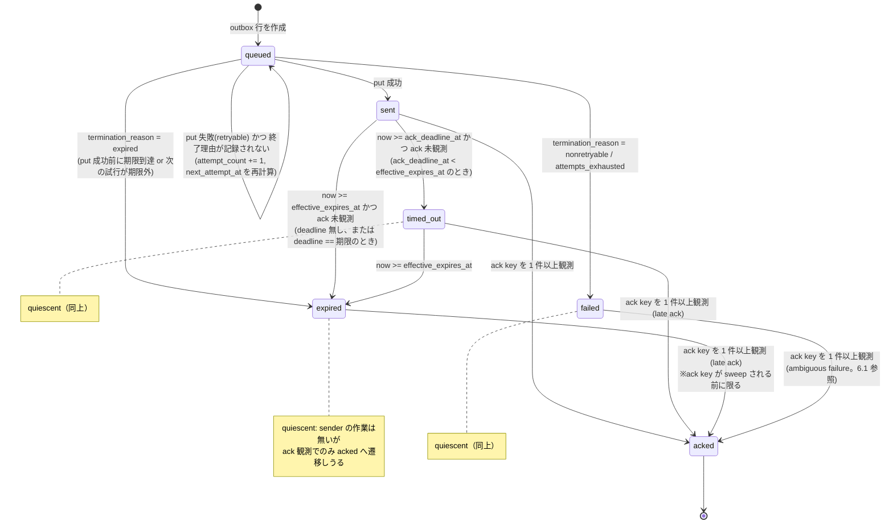

# Messaging ack timeout / 再送ポリシー設計提案 — Issue #201 (Phase 1.5)

Date: 2026-08-11
Author: W1 / Claude
Status: Proposal（未 accept。accept 後に ADR 化する想定 — 「ADR 化の判断」節参照）

## 概要

Issue #201 は `docs/design/0185-messaging-mvp-design.md` の「未解決事項」から分離された設計課題である。
MVP (#185) は「sender retry は best-effort、`requires_ack=true` でも ack が無いことを自動再送の条件に
しない」と明記して Phase 1.5 送りにした。本メモはその Phase 1.5 のポリシーを決めるための提案である。

結論を先に書く。**「ack が無いから自動再送する」は、storage-backed spool を前提とする現行設計では
ほぼ無意味であり、採用しない。** 同じ `msg_id` の再 put は同じ key への上書きで、受信されていない
原因が「receiver が読みに来ていない」である限り状況を一切変えないからである。Phase 1.5 で作るべきは
再送ループではなく、**(1) sender 側の durable outbox + transport-level retry と (2) ack を実際に読む
delivery receipt 経路**の 2 つである。詳細は「推奨案」節に書く。

## 1. 現状の挙動（コード上の事実）

推測ではなくコードで確認した事実のみを書く。行番号は本メモ作成時点 (`10a2ed4`) のもの。

### 1.1 ack timeout は存在しない

`src/kioku_mesh/messaging/` 配下に ack の期限を表す変数・設定・比較は一切無い。
timeout という語が出るのは Zenoh get の transport timeout (`mcp_server.py:907`, `purge.py:80` の
`timeout=3.0`) と tmux subprocess の `timeout=5` (`tmux_adapter.py:31,39`) のみで、いずれも
ack とは無関係である。

### 1.2 ack key に読み手が居ない

ack key は `keyspace.ack_key()` (`messaging/keyspace.py:54-56`) で
`msg/{scope}/ack/{msg_id}/{recipient_session_id}` として組み立てられる。
書き込みは 2 箇所:

- `mcp_server.ack_message()` → `mcp_server.py:1048-1052`
- `ZenohBridge.put_ack()` → `messaging/zenoh_bridge.py:95-103`

**この key を get / subscribe しているコードは `src/` 内に存在しない。**
したがって sender は現在、ack を観測する手段を持たない。ack key は write-only の痕跡でしかない。

### 1.3 `requires_ack` はどこからも読まれない

`Message.requires_ack` は `messaging/models.py:76` で定義され、`models.py:97` で JSON に載る。
**読み出し側は `src/` にも `tests/` にも無い。** 送信も受信も、このフラグで挙動を変えない。

さらに default 値が **`False`** (`models.py:76`) であり、設計 memo の
「`requires_ack` | bool | yes | MVP は default `true`」(`0185-messaging-mvp-design.md:153`) と食い違う。

### 1.4 sender 側の再送機構が無い

- `messaging/spool.py:63-69` の `send_message()` は in-process dict へ `put` するだけで、
  Zenoh にも触らず、失敗の概念自体が無い。
- `ZenohBridge.put_message()` (`messaging/zenoh_bridge.py:53-87`) は素の `self._session.put()`
  (`zenoh_bridge.py:86`) を 1 回呼ぶだけ。例外は呼び出し元へ素通しされ、キューにも積まれない。
- memory 層が使う `core.transport.with_retry` (`memory/purge.py:71` 等) は
  **`messaging/` 配下では一度も使われていない**。
- memory 層の `memory/pending_queue.py` 相当の messaging 版は存在しない。設計 memo が Phase 1 実装項目
  として挙げた「pending sender retry ... modeled after memory pending queue but separate DB」
  (`0185-messaging-mvp-design.md:522`) は未実装のままである。

messaging 層に唯一存在する retry は tmux 注入の 0.5 秒後 1 回リトライ→drop
(`messaging/tmux_adapter.py:98-111`) だが、これは local delivery adapter の注入リトライであって
message レベルの再送ではなく、注入成功は ack ではないと明記されている (`tmux_adapter.py:60-62`)。

### 1.5 そもそも production の送信経路が無い

MCP tool は `save_observation` / `search_memory` / `get_memory` / `recall_context` / `delete_memory` /
`get_memory_status` / `drain_pending_puts` / `check_messages` / `ack_message` /
`purge_expired_messages` の 10 個で、**送信 tool は無い**（`mcp_server.py` の `@mcp.tool()` 一覧）。
`__main__.py` にも messaging サブコマンドは無い（`grep -n messaging src/kioku_mesh/__main__.py` は 0 件）。
`ZenohBridge` の呼び出し元も `tests/test_messaging_zenoh_bridge.py` のみである。

つまり現在「ack を待つ sender」は production 上に存在しない。これは Phase 1.5 のスコープに
直接効く（「6. Phase 1.5 スコープ境界」参照）。

### 1.6 sender 側の delivery state ストアが無い

`LocalMessageIndex` (`messaging/local_index.py:48-156`) の `messages` 行を挿入するのは
`mcp_server.check_messages()` の `index.register(msg, session_id)` (`mcp_server.py:934`) のみで、
`session_id` は自分自身 (`get_session_id()`, `mcp_server.py:879`)。すなわちこの index は
**受信側専用**であり、送信側の状態は 1 バイトも保存されない。

### 1.7 TTL / expiry は受信側かつ破壊的

- 期限判定は `models.is_expired()` (`models.py:124-140`)。優先順位は
  `expires_at` > `ttl_sec + created_at` > 期限なし。境界演算子は **`now >= exp`** (`models.py:134,139`)。
- `Message` の default は `expires_at=None, ttl_sec=None` (`models.py:65-66`) なので、
  明示指定しない message は**永久に期限切れにならない**。memo の「`ttl_sec` required / default 900」
  (`0185-messaging-mvp-design.md:147`) とはここも食い違う。
- `check_messages` は読み取りついでに期限切れ key を Zenoh から削除する (`mcp_server.py:924-930`)。
- `purge_expired_msgs()` (`messaging/purge.py:47-110`) は `msg/**` 全体を走査して削除する
  (`purge.py:44`, `purge.py:97-101`)。自分宛に限定されない。
- ローカル側 purge は `messages` テーブルのみを削除し (`local_index.py:150-156`)、
  **`acks` テーブルは決して purge されない**。

1.7 の最後の 2 点は、後述する「同一 msg_id 再送の落とし穴」(4.2) の直接の原因である。

### 1.8 ack payload に時刻が無い

`mcp_server.py:1049` が put する ack payload は `{msg_id, recipient_session_id, status}` の 3 field で、
memo の ack schema (`0185-messaging-mvp-design.md:162-171`) にある `acked_at` を含まない。
将来 ack reader を実装しても、Zenoh 上の ack payload だけからは ack 時刻（= 配送レイテンシ）を復元できない。

### 1.9 テストで固定されている挙動

`tests/test_messaging_*.py` が仕様として固定しているのは、key 文字列の形
(`test_messaging_keyspace.py:66-94`)、spool の idempotent put と TTL フィルタ
(`test_messaging_spool.py`)、64 KiB body 上限と put/ack の key・payload 形
(`test_messaging_zenoh_bridge.py:48-158`)、purge の走査/削除挙動 (`test_messaging_purge.py`)、
tmux ガード (`test_messaging_tmux_adapter.py`) である。
**ack timeout・再送・delivery state に関するテストは 1 件も無い**ので、
Phase 1.5 はこの領域について後方互換の制約をほぼ受けない。

## 2. ack timeout の定義

### 選択肢

**A1: `expires_at` をそのまま ack deadline とする**（追加 field なし）

- 長所: schema 追加ゼロ。判定は既存の `is_expired()` (`models.py:124`) をそのまま流用できる。
  「読める期間」と「sender が待つ期間」が一致するので、状態が 1 つの時刻で説明できる。
- 短所: default TTL 15 分 (`0185:198`) を採るなら、sender は 15 分待たないと「未読のまま」を
  知れない。逆に早く知りたくて TTL を縮めると、receiver が受け取れる窓まで縮む。
  2 つの独立した関心事が 1 つのノブに束ねられる。

**A2: `ack_deadline_sec` を message schema に追加する**（推奨）

- 長所: 「いつまで読めるか (`ttl_sec`)」と「いつまでに ack が無ければ諦めるか (`ack_deadline_sec`)」を
  分離できる。sender は 60 秒で「未読」を検知しつつ、message 自体は 15 分後まで receiver が拾える。
- 長所: 未指定時の default を実効期限（後述）と同じにすれば、挙動は A1 と完全一致する。
  つまり A2 は A1 の上位互換で、移行コストが無い。
- 短所: field が 1 つ増える。不変条件 `ack_deadline_at <= effective_expires_at` を検証する責務が増える。

**A3: sender プロセスのローカル設定だけで持つ**（wire に載せない）

- 長所: schema 変更ゼロ。
- 短所: deadline が message に紐付かないため、同じ message を別プロセス / 再起動後に評価すると
  結論が変わりうる。observability ツールや receiver 側から deadline を説明できない。

### 決定: A2 を採用（A1 を default 挙動として内包）

- `Message` に `ack_deadline_sec: int | None = None` を追加する。

#### 実効期限 (effective expiry) の定義

`expires_at` と `ttl_sec` のどちらで指定されたかに依らず、**1 つの時刻 `effective_expires_at` に畳む**。
優先順位は既存の `models.is_expired()` (`models.py:124-140`) と同一にする（実装が 2 箇所で別々の
期限概念を持つと、`is_expired()` が真でも deadline 検証は通る、といった食い違いが生じるため）。

| 条件 | `effective_expires_at` |
|---|---|
| `expires_at` あり | `expires_at`（`ttl_sec` が併記されていても `expires_at` が勝つ） |
| `expires_at` 無し・`ttl_sec` あり | `created_at + ttl_sec` |
| どちらも無し | **無期限**（`None`）。拒否はしない — `models.py:65-66` の現行 default をそのまま許容する |

#### 実効 ack deadline の定義

| 条件 | `ack_deadline_at` |
|---|---|
| `ack_deadline_sec` あり | `created_at + ack_deadline_sec` |
| 未指定・`effective_expires_at` あり | `effective_expires_at`（= A1 と完全に同じ挙動） |
| 未指定・`effective_expires_at` も無し | **deadline 無し**。`timed_out` へは決して遷移しない |

#### 送信時バリデーション

`send` 経路で、Zenoh に put する**前に**評価する（`put_message` が body size 超過を拒否するのと
同じ位置・同じ扱い、`zenoh_bridge.py:66-69`）。違反はいずれも `ValueError` で拒否する。

1. **`ack_deadline_sec` は 1 以上の有限な整数**であること。`0` / 負値 / 非整数 / 非有限値は拒否する。
   `0` を許すと「送信と同時に `timed_out`」という、ack を観測する機会が構造的に存在しない状態を
   作れてしまうため。上限は設けない（`effective_expires_at` 側の不変条件 2. が実質的な上限になる）。
2. `effective_expires_at` が定義されている場合、**`ack_deadline_at <= effective_expires_at`**。
   等号は許す（未指定時の default がちょうど等号になるため）。違反は拒否し、
   **暗黙のクランプはしない** — sender が指定した deadline を黙って書き換えると、
   返す receipt の意味が sender の期待とずれるため。
3. `effective_expires_at` が**無期限**の message に `ack_deadline_sec` を指定することは
   **許可する**。この場合 2. は上限が無いので自動的に成立する。許可する理由は、
   「いつまで読めるか」と「いつまでに feedback が欲しいか」を分離するのが A2 の目的そのもので、
   receipt だけが欲しい sender に TTL 設定を強制すると A1 の短所（2 つの関心事が 1 つのノブに
   束ねられる）が戻ってくるため。この message は `timed_out` には遷移するが
   `expired` には決して遷移しない。

なお `ttl_sec` そのものの範囲（`0185:147` の min 30 / max 86400）は本メモの決定事項ではなく、
0185 の既存規定に従う。実装は現状 `ttl_sec` を必須にも範囲検証もしていない (1.7) ため、
どちらに寄せるかは 11 節の引継ぎ事項として残す。

#### 計時源と境界演算子

- **計時源**: `ack_deadline_at` / `expires_at` は wall clock UTC ISO 8601 で持つ。
  ホストを跨いで同じ文字列を比較する必要があるためで、`expires_at` の既存扱い
  (`local_index.py:22-26`, `models.py:24-28`) を踏襲する。
  一方、後述する retry backoff の**プロセス内スケジューリングだけは monotonic clock** を使う
  （NTP 補正で backoff が飛ぶのを防ぐため）。永続化する `next_attempt_at` は wall clock で書く。
- **境界演算子**: 時刻の到達判定はすべて `>=` に統一する
  （`now >= ack_deadline_at`、`now >= effective_expires_at`、`now >= next_attempt_at`）。
  既存の `is_expired()` の `now >= exp` (`models.py:134`) に揃えたもので、文書全体で例外を作らない。
  一方、**`ack_deadline_at <= effective_expires_at` は時刻の到達判定ではなく 2 つの時刻の
  順序に関する不変条件**であり、こちらは等号を含む `<=` を使う（別物なので混同しないこと）。

A3 を却下する理由は、`msg_id` が唯一の同一性の根拠である以上、その message に関する判断根拠は
message 自身に載っているべきだからである。A1 単独を却下する理由は、TTL を配送窓と feedback 遅延の
両方に使い回すと運用上どちらかを必ず妥協することになるため。

## 3. 再送回数・バックオフ方針

ここが本メモの中心である。**「再送」を 1 つの概念として扱ってはいけない。** 現行実装では失敗の
性質が 2 種類あり、有効な対処が正反対になる。

| 失敗の種類 | 何が起きたか | 同じ key への再 put は有効か |
|---|---|---|
| **transport 失敗** | `session.put()` が例外を返し、Zenoh に message が載っていない | **有効**。載るまで再試行する意味がある |
| **ack 不着** | put は成功し、message は Zenoh storage に載っている。receiver が読みに来ないか、読んで ack しない | **無効**。同じ key に同じ payload を上書きしても storage の内容は変わらない |

### 選択肢

**B1: ack 不着を条件に同一 `msg_id` を自動再 put する**

- 長所: 実装が最も単純（タイマーで再 put するだけ）。
- 短所: 上表のとおり **storage の状態を一切変えない**。receiver が offline なら message は既に
  そこにあり、online になれば `check_messages` (`mcp_server.py:900-937`) が拾う。再 put は Zenoh に
  無駄な書き込みを流すだけである。**却下。**

**B2: ack 不着を条件に新しい `msg_id` で再送する**（memo `0185:229` が示唆した方向）

- 長所: 「TTL 切れ即破棄。必要なら sender は新しい `msg_id` で再送する」という MVP 方針に沿う。
- 短所: receiver 側の dedup は `msg_id` 基準（`local_index.py:37` の PK `(msg_id, recipient_session_id)`、
  `spool.py:28-31` の idempotent put）なので、**新 `msg_id` は dedup を素通りする**。
  実際に重複表示になるかは receiver の観測履歴に依存し、2 通りに割れる:
  - 元の message を既に `check_messages` で観測していた receiver → **同一内容が 2 通**見える。
  - 期限切れになるまで一度も poll しなかった offline receiver → resend だけが見える（重複しない）。

  問題は、**sender がどちらになるかを知り得ない**ことである（ack が無いという情報だけでは
  「読まれていない」と「読んだが ack しなかった」を区別できない — 5 節の表）。
  内容の同一性を見る意味的 dedup は receiver 側にも wire 上にも無いため、この
  **回避不能な重複リスク**を receiver 側で吸収することもできない。自動で N 回繰り返せば
  リスクも N 倍になる。**自動実行としては却下**。
  人間 / エージェントが「重複してでも届けたい」と明示的に判断する再送経路としては残す
  （4.3 のルールに従う）。

**B3: transport 失敗にのみ retry を効かせ、ack 不着は「観測して報告する」**（推奨）

- 長所: 有効な対処にだけコストを払う。ack 不着に対して sender が本当に欲しいのは再送ではなく
  「未読のまま期限切れになった」という事実の通知であり、これは Issue #201 の検討項目
  「delivery receipt を UX として出すか」そのものである。
- 長所: transport retry は memory 層に既存資産がある（`core.transport.with_retry`、
  `memory/pending_queue.py`）ので、思想を流用できる。
- 短所: 「再送ポリシー」という Issue タイトルに対する答えが「自動再送はしない」になるため、
  期待とのギャップを文書で明示する必要がある（本メモがその役割を負う）。

### 決定: B3 を採用

**transport retry のパラメータ:**

- 対象は retryable な Zenoh 例外のみ。非 retryable は即 `failed` に落とす
  （分類は `core.transport` の既存 `_RETRYABLE_EXC` 相当を再利用する）。

**試行の数え方（用語を先に固定する）:**

「6 回」が initial attempt を含むのか retry だけを指すのかで総試行数も遅延の段数も変わるため、
数え方を先に一つに決める。

- **initial attempt（初回試行）を 1 回目として数える。** 「retry」は 2 回目以降の試行を指す。
  以降、本メモで「N 回」と書いたら常に **initial attempt を含む総試行回数**である。
- 永続化する `attempt_count` は **「これまでに戻り値または例外が確定した `session.put()` 呼び出しの
  回数」**（0 始まり、outbox 行の初期値は `0` = まだ 1 度も put していない `queued` 状態）。
  **各 put 呼び出しが戻った直後に、成功・失敗のどちらでも +1 する。** 次の遅延を計算する前に加算する。
  したがって「今まさに実行している試行の番号」は `attempt_count + 1`（1-indexed）になる。
- **合計 6 回で打ち切る**（initial attempt 1 回 + retry 5 回）。
- 総試行が 6 回なので、attempt 間の遅延は **5 段階**: `1s, 2s, 4s, 8s, 16s`。
  **実装契約（off-by-one を避けるため手順で書く）**: 「put 呼び出しが戻る → `attempt_count += 1`
  → 打ち切り判定（後述）→ 続行するなら `2^(attempt_count - 1)` 秒の遅延を計算して
  `next_attempt_at` を書く」。`attempt_count` は完了回数（初期値 0）であって
  「今の試行番号」ではない、という点だけ取り違えないこと。
  遅延の合計は公称 31 秒（jitter 込みの最悪値 37.2 秒）。

  | 試行番号 (`attempt_count + 1`) | 直前に待つ遅延 | 待ち終えた時点の累積経過（公称） |
  |---|---|---|
  | 1（initial attempt） | なし | 0s |
  | 2（retry 1） | 1s | 1s |
  | 3（retry 2） | 2s | 3s |
  | 4（retry 3） | 4s | 7s |
  | 5（retry 4） | 8s | 15s |
  | 6（retry 5、最後） | 16s | 31s |

- **6 回・5 段階を選んだ根拠**: (i) 遅延合計 31 秒は既定 TTL 900 秒 (`0185:147`) の約 3.5% で、
  期限内に十分収まる（retry が TTL を食い潰して受信窓を削る事態を避ける）。
  (ii) Zenoh セッションの再接続は秒オーダーで完了するため、最終遅延 16 秒を超えても回復しない
  障害は「一時的」とは見なさない、という線引き。(iii) memory 層の `core.transport.with_retry` と
  同じ指数 backoff の形を保ったまま、段階数だけを messaging の用途（対話的な依頼の配送。
  分単位で待たせる価値が無い）に合わせて短くした。
  **この 6 という値は運用計測で見直す前提のチューニングパラメータ**であり、
  設計上の不変条件は「上限が有限であること」だけである（12 節「未決事項」参照）。
- 遅延そのものに対する別途の上限（「最大 60 秒」等のクランプ）は**設けない**。
  遅延列は `16s` で終わる有限列なのでクランプが働く余地が無く、上限秒を書くと
  7 回目以降の試行が存在するかのように読めてしまうため。
- 各遅延に **±20% の jitter** を掛ける（複数 worker が同時に切断復帰したときの同期を崩すため）。
  実効遅延 = 公称遅延 × `uniform(0.8, 1.2)`。jitter は打ち切り条件を変えない
  （打ち切りは回数と `effective_expires_at` だけで決まる）。
- **計時源**: 待ちのスケジューリングは monotonic clock、永続化する `next_attempt_at` は wall clock
  （2 節「計時源」と同じ理由）。プロセスが再起動した場合は `now >= next_attempt_at` で再開判定する。
- **打ち切り判定**は、各 put が戻って `attempt_count` を加算した直後に 1 回だけ実行する。
  上から評価し、**最初に真になったものを `termination_reason` として outbox 行に 1 つだけ記録する**
  （複数は記録しない。これが state の一意性の根拠になる）:
  1. `effective_expires_at` が定義されていて `now >= effective_expires_at`、または次の試行予定時刻が
     期限以降になる（`next_attempt_at >= effective_expires_at`）→ `termination_reason = expired`。
     **この条件が回数上限より優先する**（期限切れ message を storage に載せても誰も読めないため。
     また、結果が確定している待ちを挟まないため）。
  2. 直前の例外が非 retryable → `termination_reason = nonretryable`。
  3. `attempt_count >= 6` → `termination_reason = attempts_exhausted`。
  4. put が成功していた → 終了理由は記録せず `sent` へ。
  5. いずれでもない → 終了理由を記録せず、`next_attempt_at` まで待って次の試行を実行する。
- **1 回の put で複数条件が同時に真になっても、記録されるのは最初の 1 つだけ**である。
  例: 「6 回目の put が失敗し、その put の実行中に `effective_expires_at` を跨いだ」場合は
  1. が先に真になるので `expired` が記録され、`attempts_exhausted` は記録されない。
  この一意性が無いと、同じ行を `expired` とも `failed` とも読める状態が生まれる。
- **この評価順は 6.4 の state 判定順とは意図的に異なる。** ここは「次に何をするか」を決める順序で、
  期限切れ後に無駄な put を積まないために expiry を先に見る。6.4 は「記録済みの事実に
  どの名前を付けるか」を決める順序である。**両者が食い違わないのは、6.4 が生の `attempt_count` や
  `now` ではなく、ここで記録した `termination_reason` を読むから**である。
  たとえば `next_attempt_at >= effective_expires_at` で打ち切った行は、まだ
  `now < effective_expires_at` の時点でも `termination_reason = expired` を根拠に `expired` と
  報告される（`now` を見て `queued` に戻ることはない）。
- `effective_expires_at` が無期限の message では条件 1. が決して真にならず、打ち切りは回数上限
  (3.) だけで決まる。**待ちが無限になる経路は存在しない**（最長でも 6 回・公称 31 秒で確定する）。
- 個々の `session.put()` 呼び出し自体の時間上限は Zenoh 側の既定 timeout に委ねる。

**ack 観測（timeout 検知）のパラメータ:**

- ack reader は `msg/{scope}/ack/{msg_id}/**` を **get** する（`timeout=3.0` 秒。
  `mcp_server.py:907` / `purge.py:80` と同じ値に揃える）。subscribe ではなく get を採るのは、
  sender プロセスが常駐でない（MCP server は request 駆動）ためである。
- 観測タイミングは (a) sender が明示的に状態照会したとき、(b) outbox の drain 実行時 の 2 つ。
  常駐ポーリングスレッドは持たない（`purge.py:15-18` が periodic background GC を却下したのと同じ理由 —
  MCP server は他が stateless なのに lifecycle 管理だけ増えるため）。

## 4. 冪等性 / 重複配信

### 4.1 現状で効いている冪等性

- **storage レベル**: key に `msg_id` が入る (`keyspace.py:35-51`) ので、同一 `msg_id` の再 put は
  同じ key への上書きになり、message は増えない。
- **spool レベル**: `MessageSpool.put()` は既知 `msg_id` を黙って捨てる (`spool.py:28-31`)。
- **index レベル**: `messages` の PK が `(msg_id, recipient_session_id)` (`local_index.py:37`)、
  `register()` は `IntegrityError` を握って `False` を返す (`local_index.py:84-85`)。
- **表示レベル**: `check_messages` は複数 selector を跨いで `seen_ids` で dedup する
  (`mcp_server.py:916-919`)。

したがって「同じ `msg_id` を何度 put しても receiver には 1 通」は既に成立している。

### 4.2 落とし穴: purge の非対称性（Phase 1.5 で直す）

`LocalMessageIndex.purge_expired()` は `messages` だけを削除し、`acks` を残す
(`local_index.py:150-156`)。この状態で同じ `msg_id` を再 put すると:

1. `register()` は `messages` 行が消えているので新規挿入に成功する (`local_index.py:71-83`)。
2. しかし `check_messages` のフィルタ `index.is_acked(msg.msg_id, session_id)` (`mcp_server.py:951`) は
   生き残った `acks` 行を見て **True** を返す。
3. 結果、再送された message は**エラーも警告も無く receiver に表示されない**。

Phase 1.5 では `purge_expired()` を `messages` と `acks` の両方に効かせる（同一トランザクションで
`DELETE FROM acks WHERE (msg_id, recipient_session_id) IN (削除対象)`）。
併せて「**expiry-purge 済みの `msg_id` を再利用してはならない**」を規約として明文化する。

### 4.3 明示再送のルール

自動再送はしないが、人間 / エージェントが同じ内容を送り直したい場合はある。そのときは:

- **新しい `msg_id` を採番する**（4.2 の罠を踏まないため、および receiver の dedup を尊重するため）。
- 元の message を `correlation_id` (`models.py:78`) で紐付ける。
- 受信側は「同じ `correlation_id` の既読 message がある」ことを表示できるが、
  自動抑制はしない（抑制すると「本当に届いていない」ケースを潰すため）。

## 5. ack を返さない receiver の扱い

ack が来ない原因は少なくとも 3 つあり、sender にとって意味が違う。

| 原因 | presence の見え方 | 妥当な扱い |
|---|---|---|
| receiver session がそもそも存在しない（未起動 / 終了済み） | 対象 `agent_id` の presence key 無し | `no_recipient` — 宛先誤り or タイミングの問題。sender に即時に返す価値が最も高い |
| receiver は生きているが turn 中 / まだ poll していない | presence あり (TTL 90s, `0185:295`) | 通常の待ち。deadline まで待つ |
| receiver は読んだが ack を呼ばなかった | presence あり | 区別不能。`unacked` として扱う |

**決定:**

- deadline 到達時に一度だけ presence を lookup し (`messaging/presence.py`)、
  `no_recipient_present` / `unacked` のどちらであったかを **receipt に記録する**。
  この分類は診断情報であり、再送の可否を分岐させない。
- **送信時点での presence 事前チェックはしない**。presence は宛先解決用の soft state であって
  認可でも到達保証でもない (`0185:251`, `0185:303`)。「presence が無いから送らない」にすると、
  これから起動する agent 宛の spool という MVP の中心価値 (ADR-0022 の「短期 inbox spool」) を壊す。
- **他 adapter への自動エスカレーション（tmux 注入へのフォールバック等）はしない。**
  tmux 注入は remote input injection に相当し既定 off (`0185:399`, `tmux_adapter.py:64-65`)。
  ack 不着という弱い信号でセキュリティ既定値を覆すのは筋が悪い。Phase 1.5 スコープ外とする。

## 6. delivery state machine（最小設計）

sender 側の状態のみを定義する。receiver 側は既存の「登録済み / acked / purged」で変更しない。

### 6.1 terminal の定義

用語を先に固定する。曖昧さの元は「terminal」を「もう送信側が何もしない」の意味と
「もう二度と state が変わらない」の意味で混用することにある。本メモは**後者だけ**を terminal と呼ぶ。

- **terminal（終端）= 出ていく遷移が 1 本も無い state。** `acked` **のみ**。
- **quiescent（静止）= sender 側の能動的な作業（put / 待ち）はもう無いが、ack を観測すれば
  まだ `acked` へ遷移しうる state。** `timed_out` / `expired` / `failed` の 3 つ。

**決定: `expired` は terminal ではなく quiescent とする。**
理由は、ack reader が状態照会時にしか動かない（3 節）以上、「`expires_at` を過ぎた後に初めて
ack key を観測する」は正常系として起こるためである。ここで `expired` を terminal にすると、
ack key が目の前にあるのに `expired`（= 未配送）と報告することになり、receipt が事実に反する。
逆に `acked` は 4 つの中で唯一「receiver が実際に処理した」という直接証拠を持つので、
後から確定しても上書きしてよい。

**決定: `failed` も terminal ではなく quiescent とする。**
put の失敗は「client 側がそう観測した」という事実でしかなく、`session.put()` が例外を返しても
storage には載っていた、という曖昧な失敗 (ambiguous failure) が起こりうる。その場合 receiver は
普通に message を読んで ack する。したがって `failed` から `acked` への遷移は実際に発生しうるので、
図と表の両方でこれを許す。**terminal は `acked` ただ 1 つ**であり、
「もう sender は何もしない」を意味するのは quiescent の方である。

**late ack の観測窓には上限がある。** ack key は `msg/{scope}/ack/...` すなわち `msg/**` 配下なので、
`purge_expired_messages` の sweep (`purge.py:44`) で消える。消えた後は `expired` のまま確定する。
sweep は手動実行なのでこの窓の長さは運用依存であり、**設計上の保証は「窓は有限」までとする**
（12 節「未決事項」参照）。加えて outbox 行自体にも保持上限を置く（6.4）。

### 6.2 状態遷移図

図に無い遷移は存在しない。特に:

- **retryable な put 失敗は `queued` の自己ループ**である。retry は `sent` に到達する**前**に
  起きる。`sent` は put が成功した後の state なので、**`sent` から `queued` へ戻る遷移は存在しない**
  （retry を `sent -> queued` と描くと、put 成功後にもう一度 put する経路があるように読める）。
- 同じ理由で `sent` から `failed` への遷移も無い（put が成功した以上、transport は成功している）。
- `requires_ack = false` の message は ack 待ちをしない（7 節の項目 7）。この場合
  `sent` が quiescent であり、`timed_out` / `expired` / `acked` へは遷移しない。

### 6.3 state 一覧

| state | 種別 | 意味 | 入る条件 | 出る先 |
|---|---|---|---|---|
| `queued` | 進行中 | outbox に入ったが Zenoh に載っていない | 初期状態、または retryable put 失敗後 | `queued` / `sent` / `failed` / `expired` |
| `sent` | 進行中 (`requires_ack=false` なら quiescent) | `session.put()` が 1 回以上成功した | put 成功 | `acked` / `timed_out` / `expired` |
| `timed_out` | quiescent | `now >= ack_deadline_at` かつ ack 未観測。まだ `effective_expires_at` 前なので受信の可能性は残る | deadline 到達 | `acked` / `expired` |
| `expired` | quiescent | 配送は放棄された。**error ではない** (`0185:229`) | `termination_reason = expired`、または `now >= effective_expires_at` かつ ack 未観測 | `acked`（late ack のみ） |
| `failed` | quiescent | 非 retryable 失敗、または総試行 6 回到達。message は Zenoh に載っていない可能性が高い。**error である** | `termination_reason` が `nonretryable` / `attempts_exhausted` | `acked`（ambiguous failure のみ、6.1） |
| `acked` | **terminal** | `msg/{scope}/ack/{msg_id}/**` に 1 件以上の ack key を観測 | ack 観測（`sent` / `timed_out` / `expired` / `failed` のいずれからでも） | — |

`no_recipient_present` / `unacked`（5 節）は state ではなく、`timed_out` / `expired` に付随する
**診断ラベル**である。state 機械の遷移には影響しない。

### 6.4 同時成立時の優先順位（タイブレーク）

複数条件が同時に真になりうるため、**記録済みの事実から「今この行を何と呼ぶか」を決める順序**を
明示する。これは outbox 行を入力として state を返す単一の純関数（reducer）として実装する。

**前提: 評価の冒頭で `now` を 1 度だけ読み、以下のすべての条件で同じ値を使う。**
条件ごとに時計を読み直すと、同じ 1 回の照会の中で `now >= ack_deadline_at` と
`now >= effective_expires_at` の判定が別々の時刻に基づいてしまい、境界をまたぐ瞬間に
矛盾した結果を返しうるため。

上から順に評価し、最初に真になったものを採る:

1. `acked` — ack key を 1 件以上観測している。他の何よりも優先する。
   `effective_expires_at` を過ぎた後に観測した ack も、`failed` を記録した後に観測した ack も
   `acked` として扱う（ack は「実際に処理された」という最も強い証拠であるため。6.1 参照）。
2. `termination_reason` が記録されていれば、その写像を採る（`now` は見ない）:
   `nonretryable` / `attempts_exhausted` → `failed`、`expired` → `expired`。
3. `expired` — `effective_expires_at` が定義されていて `now >= effective_expires_at`。
4. `timed_out` — `ack_deadline_at` が定義されていて `now >= ack_deadline_at`。
5. `sent` — 成功した put が 1 回以上ある。
6. `queued` — 上のいずれでもない。

**`requires_ack = false` の行は 1. / 3. / 4. を評価しない**（2. → 5. → 6. の順で評価する）。
ack も deadline も見ないので、put が成功した行は `sent` のまま quiescent になる（6.2 の注記）。

`ack_deadline_at == effective_expires_at`（`ack_deadline_sec` 未指定時の default）のときは
3. が先に真になるので、**`timed_out` は観測されずに直接 `expired` になる**。
6.2 の図で `sent --> expired` を別の辺として描いてあるのはこのケースである。

**この順序は 3 節の「打ち切り判定」の評価順（expiry → 非 retryable → 回数）とは意図的に異なる。**
3 節は「次に put するか否か」を決める順序、ここは「確定済みの事実にどの名前を付けるか」を
決める順序である。2. が生の `attempt_count` / `now` ではなく `termination_reason` を読むことで、
両者は必ず同じ結論に到達する（3 節末尾参照）。

**outbox 行の保持上限:** quiescent または terminal に入った行は、その時刻から wall clock で
**24 時間**保持し、以後 GC する。GC 後の `get_message_status(msg_id)` は `unknown` を返す。
24 時間の根拠は (i) late ack を拾う窓としては ack key 側（sweep 依存、6.1）の方が先に閉じるので、
outbox 側がボトルネックにならない長さであれば足りる、(ii) 人間が翌日に「あの依頼どうなったか」を
確認できる長さ、の 2 点。**これもチューニング値**であり、不変条件は「outbox 行が無限に貯まらない
こと」だけである。この上限があるため、**どの state からも「無期限に待ち続ける」経路は存在しない**
（無期限 message の `sent` も、24 時間後に GC されて `unknown` になる）。

**明示的に state に含めないもの:**

- `delivered` / `injected`: receiver が message を読んだこと自体は観測できない
  （ack key しか wire に出ない）。tmux 注入成功はローカルにしか記録されず、publish もされないし
  semantic ack でもない (`tmux_adapter.py:60-62`)。観測できない状態を state machine に置かない。

**outbox 行が持つべき最小の field**（state は保存せず、下記から 6.4 の reducer で導出する）:
`msg_id`、`created_at`、`effective_expires_at`（畳み込み済み、無期限なら NULL）、
`ack_deadline_at`（無ければ NULL）、`attempt_count`（完了した put 回数、初期 0）、
`last_put_succeeded`（bool）、`next_attempt_at`（wall clock、無ければ NULL）、
`termination_reason`（`expired` / `nonretryable` / `attempts_exhausted` のいずれか、未確定なら NULL）、
`acked_at`（ack 観測時刻、未観測なら NULL）、`quiesced_at`（6.4 の保持上限の起点）。

**永続化先:** `state_dir()/messaging/outbox.db`（`inbox.db` (`mcp_server.py:180`) とは別ファイル）。
inbox と分けるのは、purge の対象・寿命・所有者が違うためである
（inbox は受信した他人の message、outbox は自分が送った message）。

## 7. Phase 1.5 スコープ境界

### 含める

1. **production 送信経路**（前提条件）。現状 send tool も CLI も無い (1.5) ため、
   ack timeout を議論する主体そのものが存在しない。`send_message` の MCP tool 化 or CLI 化が
   Phase 1.5 の最初の作業になる。
2. **sender outbox** (`outbox.db`) と 6 節の delivery state machine。
3. **transport-level retry**（3 節のパラメータ）。`core.transport.with_retry` の思想を messaging に
   持ち込み、`ZenohBridge.put_message` (`zenoh_bridge.py:86`) の裸の put を置き換える。
4. **ack reader**: `msg/{scope}/ack/{msg_id}/**` の get（timeout 3.0s）。
5. **`ack_deadline_sec` field** と 2 節のバリデーション（実効期限の畳み込み、
   `ack_deadline_sec >= 1` の有限整数チェック、不変条件 `ack_deadline_at <= effective_expires_at`）。
6. **delivery receipt の提示面**: 状態照会 API（`get_message_status(msg_id)` 相当）。
   `timed_out` / `expired` を返すときに 5 節の分類 (`no_recipient_present` / `unacked`) を添える。
   GC 済み (6.4) の `msg_id` には `unknown` を返す。
7. **`requires_ack` を実際に読む**。`False` の message は ack 待ちをせず、put 成功時点で
   `sent` を quiescent 扱いにする（`timed_out` / `expired` / `acked` へは遷移しない。6.2 参照）。
   併せて default を memo (`0185:153`) に合わせて `True` にするか、memo 側を実装に合わせるかを
   ここで確定する（本メモの推奨は **実装を memo に合わせて `True` にする**。
   `requires_ack` を送信者が意識せず送った message が receipt 対象外になるのは驚き最小則に反する）。
8. **`acks` テーブルの purge** (4.2) と ack payload への `acked_at` 追加 (1.8)。

### 明示的に含めない

- **ack 不着を条件とする自動再送**（3 節 B1/B2 の却下理由による）。
- **receiver 側 NAK**（`0185:226-227` の MVP 判断を踏襲。missing detection と ordering state が要る）。
- **adapter エスカレーション**（tmux 等への自動フォールバック。5 節の理由による）。
- **broadcast / topic 宛の ack 集約**。ADR-0022 の初期スコープが direct のみであるため。
- **ホストを跨ぐ outbox 同期**。outbox は送信プロセスのローカル状態に留める。
- **#193 の ack 集約 UX**（次節）。

## 8. Issue #193（multi-session ack 集約）との関係整理

#193 は「同じ `agent_id` の複数 session が並行起動しているとき、`inbox/agent/{agent_id}/**` への ack を
どう扱うか」という受信側 UX の課題である。

**重なる部分:** Phase 1.5 の ack reader は `msg/{scope}/ack/{msg_id}/**` を wildcard で読む以上、
「何件の ack が、どの session から来たか」を必然的に手に入れる。したがって sender 側は
「acked と見なす述語」を必ず 1 つ選ばざるを得ない。

**決定（#201 のスコープに含める最小限）:** sender 側の `acked` 判定は
**「1 件以上の ack key が存在すること」**とする。agent 宛 message で 3 session が起動していても、
1 session が ack すれば sender にとっては配送成功である。

- 理由: sender の関心は「誰かが受け取って処理したか」であり、全 session の既読管理ではない。
- 理由: 「全 session の ack を待つ」を選ぶと、いつ起動するか分からない session の数を
  sender が知る必要があり、presence の soft state に配送判定を依存させることになる（5 節で却下した依存）。

**#193 に残す部分:**

- 「誰が読んだか」の可視化 UX。
- 「いずれか 1 session が ack すれば**受信側でも**全 session で既読扱いにする」かどうか
  （現状は session ごとに独立 ack — `local_index.py:37` の PK と `mcp_server.py:1025` の
  `session_id = get_session_id()`）。
- ack 集約レイヤーを bridge / messaging のどちらに置くか。

本メモの決定は sender 側の述語を 1 つ固定するだけで、受信側の集約方針を先取りしない。
#193 がどう決着しても、sender 側の「1 件以上で acked」は成立し続ける。

## 9. 推奨案（1 つに絞った結論）

> **ack 不着を条件とする自動再送は実装しない。** 代わりに Phase 1.5 では
> **sender outbox (`outbox.db`) + transport-level retry（指数 backoff、initial attempt 込みで合計 6 回、
> `effective_expires_at` で強制打ち切り）+ ack key reader による delivery receipt** を実装し、
> ack timeout は `ack_deadline_sec`（未指定時は `effective_expires_at` にフォールバック）で定義する。
> `timed_out` / `expired` は sender への**通知**であって再送のトリガーではない。

**採用理由（3 点）:**

1. **有効性**: 同一 key への再 put は storage の内容を変えないため、ack 不着に対する再送は
   物理的に無意味である (3 節)。新 `msg_id` での自動再送は receiver に重複を作る (`local_index.py:37`)。
2. **既存方針との整合**: MVP は「TTL 切れ即破棄は delivery abandoned であり error ではない」
   (`0185:229`) と決めている。receipt はこの方針を変えずに、sender が abandonment を
   **能動的に知れない**という Issue #201 の問題だけを解く。
3. **実装コスト**: transport retry は memory 層の `with_retry` / `pending_queue` の思想を流用でき、
   ack reader は既存の ack key 空間 (`keyspace.py:54`) をそのまま読むだけで、
   **wire format の破壊的変更を伴わない**（追加は `ack_deadline_sec` と ack payload の `acked_at` のみ、
   どちらも `_extras` による forward compat 機構 (`models.py:109-111`) の範囲内）。

**却下した案と却下理由（再掲）:**

| 却下案 | 却下理由 |
|---|---|
| B1: 同一 `msg_id` の自動再 put | storage 状態が変わらず無意味 (3 節の表) |
| B2: 新 `msg_id` の自動再送 | receiver dedup が `msg_id` 基準なので新 id は素通りし、元 message を既に観測した receiver には重複表示される。誰がそうなるかを sender は判別できず、意味的 dedup も無いため回避不能な重複リスクを負う (3 節 B2) |
| A1 単独: `expires_at` を ack deadline に固定 | 配送窓と feedback 遅延が 1 つのノブに束ねられる |
| A3: deadline を sender ローカル設定のみで持つ | 同一 message の判定がプロセス / 再起動で揺れる |
| receiver 側 NAK | missing detection + ordering state が必要。MVP 判断 (`0185:226`) を維持 |
| 送信前 presence チェック | 未起動 agent 宛 spool という ADR-0022 の中心価値を壊す |
| ack 不着時の tmux 自動エスカレーション | 弱い信号でセキュリティ既定値 (`tmux_adapter.py:64-65`) を覆すため |

## 10. ADR 化の判断

本メモは **ADR にしない**。理由:

- 本リポジトリの ADR (`docs/adr/0022`, `0029` 等) は `Status: Accepted` の**確定した意思決定**を記録する
  形式であり、レビュー前の提案を置く場所ではない。
- Issue #201 は設計課題の起票であって、運用者による採否がまだ無い。
- 先例として、messaging MVP そのものも ADR-0022（決定）と `0185-messaging-mvp-design.md`（設計 memo）に
  分離されている。本メモは後者と同じ層に属する。

**ADR 化する条件:** 本提案（特に「自動再送しない」という否定形の決定と、6 節の state machine）が
レビューで accept されたら、`docs/adr/0031-messaging-delivery-receipt-policy.md` として
ADR 化する。ADR-0022 の Related に追加し、本メモを設計根拠として参照する形にする。

## 11. 実装時の注意（Phase 1.5 引継ぎ）

- ADR-0023 の layering を維持する: `messaging` は `memory` を import しない。
  `core.transport` の retry は `core` 経由なので利用可 (`memory/purge.py:53` と同じ形)。
- `outbox.db` は `inbox.db` (`mcp_server.py:180`) と別ファイルにする。
- `purge_expired_messages` (`mcp_server.py:1061`) は `msg/**` 全体を掃く (`purge.py:44`) ので、
  他 agent の未読 message も消える。outbox の state 判定がこの sweep と競合しないよう、
  「key が消えている」ことを `failed` の根拠にしてはならない（`expired` と区別できないため）。
- 1.3 / 1.7 で挙げた memo と実装の食い違い（`requires_ack` の default、`ttl_sec` の必須性）は
  Phase 1.5 で必ずどちらかに寄せる。放置すると receipt の対象範囲が実装依存になる（12 節 U1）。

## 12. 未決事項

本メモが**決めていない**ことを明示する。ここに挙げた項目は断定調で書いていないので、
実装時に「文書がこう決めている」と読まないこと。それ以外の記述はすべて決定事項である。

| id | 未決の内容 | 決めるのに必要なもの | 決定者 |
|---|---|---|---|
| U1 | `requires_ack` の default を `True`（memo `0185:153` 側）に寄せるか、`False`（実装 `models.py:76` 側）に寄せるか。本メモの**推奨**は `True`（送信者が意識せず送った message が receipt 対象外になるのは驚き最小則に反するため）だが、決定ではない | 送信経路 (7 節の項目 1) が出来た後の実利用パターン。ack を要求しない「通知だけ」の用途がどれくらいの割合を占めるか | Phase 1.5 の実装判断として運用者 + 実装者 |
| U2 | `ttl_sec` を必須にするか（memo `0185:147`）、現行実装どおり省略可（= 無期限）のままにするか | 無期限 message が実際に作られるか、作られた場合に outbox 保持上限 24h (6.4) だけで運用が回るかの観測 | 同上 |
| U3 | 総試行 6 回・遅延 5 段階 (`1,2,4,8,16s`) という具体値の妥当性。**有限であること自体は決定事項**で、未決なのは値のみ | 実運用での Zenoh put 失敗率と、失敗が回復するまでの実測時間分布。少なくとも「6 回目で成功した割合」を計測できるログが要る | 計測後に実装者が調整（設計変更を伴わない） |
| U4 | outbox 行の保持 24 時間 (6.4) という具体値。**上限を置くこと自体は決定事項** | 状態照会がどれくらい後に行われるかの実績。`unknown` を返した回数を数えれば足りる | 同上 |
| U5 | late ack（`expired` → `acked`）を観測できる窓の長さ。ack key は `purge_expired_messages` の手動 sweep (`purge.py:44`) で消えるため、窓の長さは運用依存で**保証できるのは「有限」までである** | sweep を定期実行にするか否かの運用方針。定期化するならその間隔 | 運用者。定期化を選ぶ場合は別 Issue（本メモのスコープ外） |
| U6 | `no_recipient_present` / `unacked`（5 節）を receipt でどう提示するか（文言・UX） | delivery receipt の提示面 (7 節の項目 6) の UI 設計 | Phase 1.5 の実装時 |

## Related

- Issue #201, Issue #185, Issue #193
- ADR-0022 (`docs/adr/0022-zenoh-agent-messaging-flow-layer.md`)
- ADR-0023 (core / memory / messaging layering)
- `docs/design/0185-messaging-mvp-design.md`（「再送戦略」「未解決事項」）
